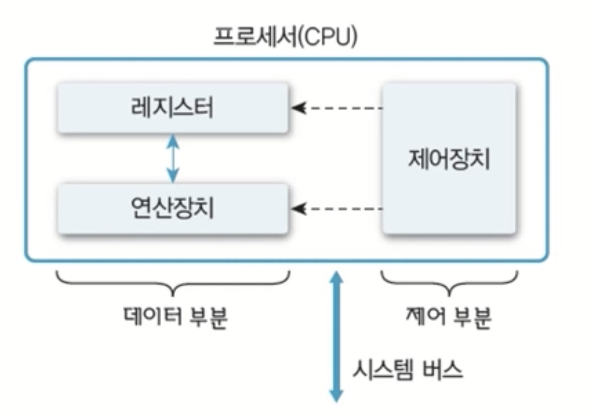
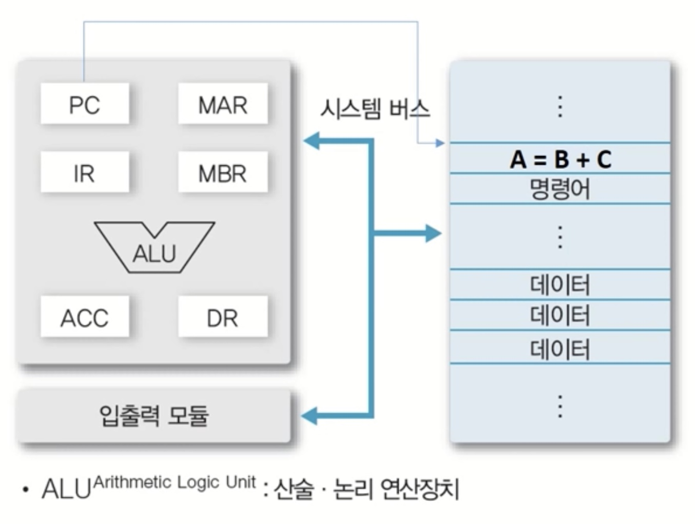
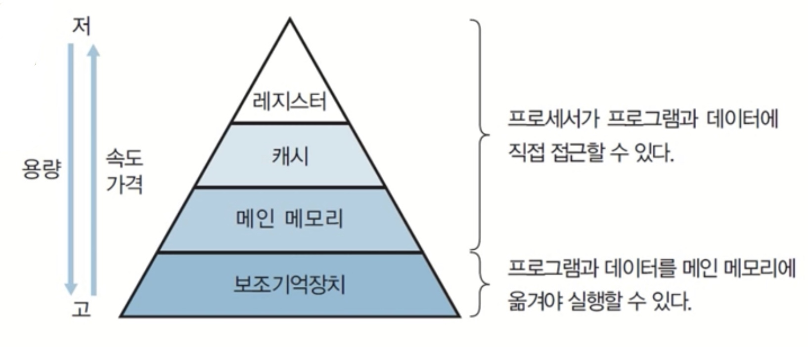
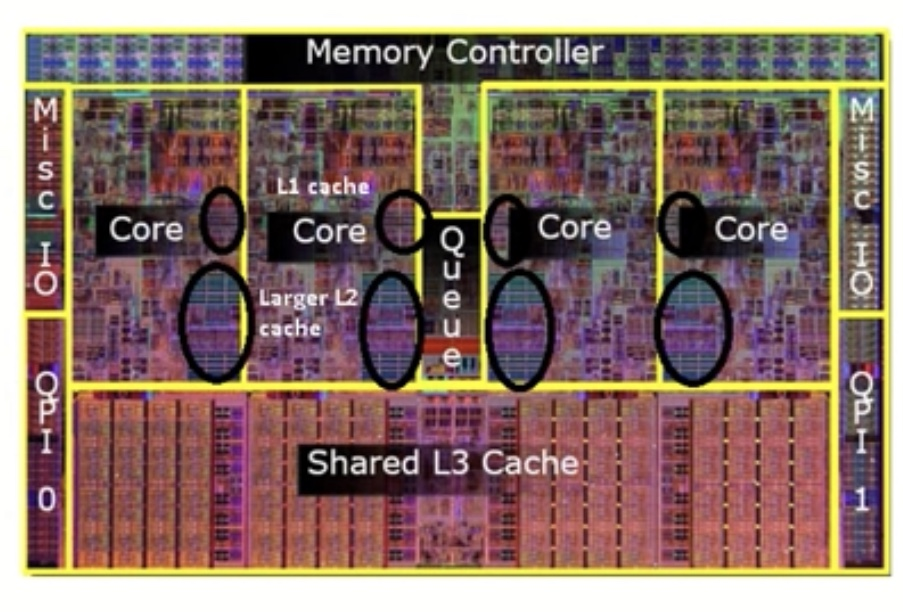
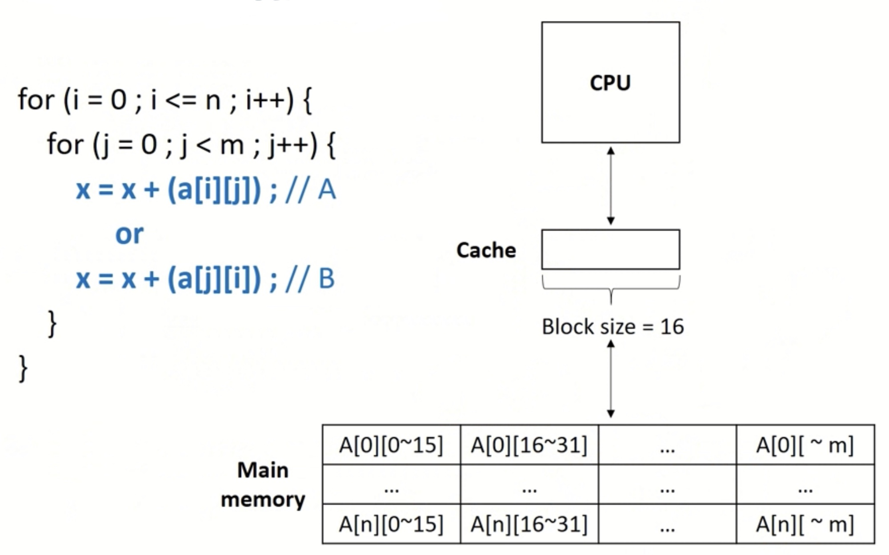
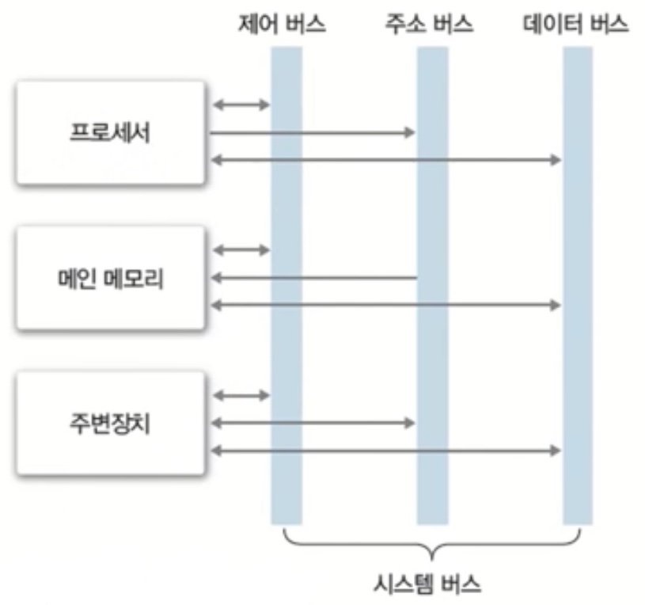
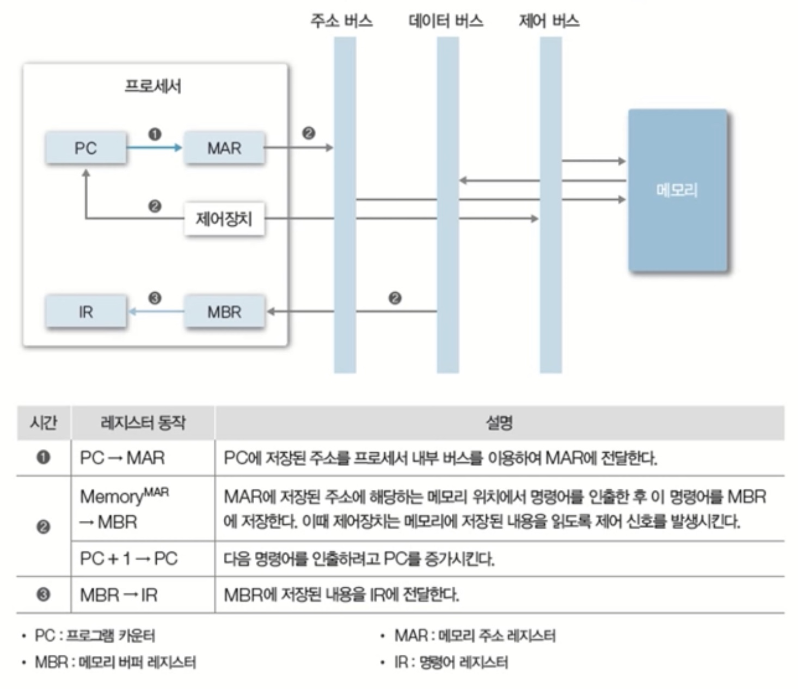

> ## __Chapter 1 컴퓨터 시스템 개요__
> #### 1차 스터디 모임 : 2021.08.25 Wed
> 
>> ##### __운영체제(OS, Operation System)__
>> - 컴퓨터 시스템 자원(Hardware, HW) 관리
>> - 응용 프로그램(Application, App)나 사용자에게 서비스 제공
---
# __컴퓨터 시스템 자원(Hardware, HW)__
- 프로세서(Processor)
  - CPU, GPU(그래픽카드), 응용 전용 처리장치 등
- 메모리(Memory)
  - 주 기억장치, 보조 기억장치 등
- 주변장치

  - 키보드/마우스, 모니터, 프린터, 네트워크 모뎀 등

---

# __프로세서(Processor)__
### __<구성>__
- 레지스터
- 연산장치
- 제어장치

</img>

### __<동작>__
- 연산 수행
- 컴퓨터의 모든 장치의 동작 제어 

</img>

#

## __레지스터(Register)__
- 프로세서 내부에 있는 메모리
- 프로세서가 사용할 데이터 저장
- 컴퓨터에서 가장 빠른 메모리

__<분류>__
- __용도에 따른 분류__
  - 전용 레지스터
  - 범용 레지스터

- __사용자가 정보 변경 가능 여부에 따른 분류__
  - 사용자 가시 레지스터
    - 데이터 레지스터(DR, Data Register)
    - 주소 레지스터(AR, Address Register)
  - 사용자 불가시 레지스터
    - __프로그램 카운터(PC, Program Counter)__
      : 다음에 실행할 명령어의 주소를 보관하는 레지스터
    - __명령어 레지스터(IR, Instruction Register)__
      : 현재 실행하는 명령어를 보관하는 레지스터
    - __누산기(ACC, Accumulator)__
      : 데이터를 일시적으로 저장하는 레지스터
    - 메모리 주소 레지스터(MAR, Memory Address Register)
      : 프로세서가 참조하련느 데이터의 주소를 명시, 메모리에 접근하는 버퍼 레지스터
    - 메모리 버퍼 레지스터(MBR, Memory Buffer Register = MDR, Memory Data Register)
      : 프로세서가 메모리에서 읽거나 저장할 데이터 자체를 보관하는 버퍼 레지스터

- __저장하는 정보의 종류에 따른 분류__
  - 데이터 레지스터
  - 주소 레지스터
  - 상태 레지스터

#

## __운영체제와 프로세서의 관계__
- 프로세서에게 처리할 작업 할당 및 관리
  - 프로세스 생성 및 관리
  - 3장
- 프로그램의 프로세서 사용 제어
  - 프로그램의 프로세서 사용 시관 관리 
  - 복수 프로그램간 사용 시간 조율 등
  - 4~5장

---

# __메모리(Memory)__
: 데이터를 저장하는 기억장치

### __<종류>__
- 레지스터
- 캐시
- 주기억장치(Main Memory)
- 보조기억장치

</img>

#

## __캐시(Cache)__
- 프로세스 내부에 있는 메모리(L1, L2 캐시 등)
- 속도가 빠르고, 가격 비쌈
- 메인 메모리의 입출력 병목현상 해소

</img>

### __<캐시의 동작>__
- 일반적으로 하드웨어적으로 관리 됨
- 캐시 히트(Cache Hit) : 필요한 데이터 블록이 캐시 존재
- 캐시 미스(Cache Miss) : 필요한 데이터 블록이 없는 경우

### __지역성(Locality)__ 
</img>
- 공간적 지역성(Spatial Locality) : 참조한 주소와 인접한 주소를 참조하는 특성
  - _캐시 라인 혹은 캐인 블럭을 가져오는 캐시의 특징 덕분!_
  - 순차적 프로그램 등
- 시간적 지역성(Temporal Locality) : 한 번 참조한 주소를 곧 다시 참조하는 특성
  - for문과 같은 순환문 등

=> 캐시 적중률(Cache Hit Ratio)과 밀접

## __주 기억장치(Main Memory)__
- 프로세서가 수행할 프로그램과 데이터를 저장
- DRAM 주로 사용
- 용량이 크고, 가격 저렴
- 디스크 입출력 병목현상(I/O bottleneck) 해소

## __보조 기억장치(Auxiliary Memory / Secondary Memory / Storage)__
- 프로그램과 데이터 저장
- 용량이 크고, 가격 저렴
- 프로세서가 직접 접근할 수 없음
  - 주기억장치를 거쳐서 접근
  - 가상 메모리(Virtual Memory) 사용; 주기억장치 < 프로그램/데이터

#

## __운영체제와 메모리의 관계__
- 메모리 할당 및 관리
  - 프로그램의 요청에 따른 메모리 할당 및 회수
  - 할당된 메모리 관리
  - 7장
- 가상 메모리 관리
  - 가상 메모리 생성 및 관리
  - 논리주소->물리주소 변환
  - 8장
---
# __주변장치__
: 프로세서와 메모리를 제외한 하드웨어 입력/출력/저장장치

- 입력장치
- 출력장치
- 저장장치
  
#

## __운영체제와 주변장치의 관계__
- 장치 드라이버 관리
  - 주변 장치 사용을 위한 인터페이스 제공
- 인터럽트 처리
  - 주변 장치의 요청 처리
  - 3장
- 파일 및 디스크 관리
  - 파일 생성 및 삭제
  - 디스크 공간 관리
  - 9~10장
---
# __시스템 버스(System Bus)__
:  하드웨어들의 데이터 및 신호를 주고 받는 물리적 통로

</img>

### __<종류>__
- 데이터 버스
- 주소 버스
- 제어 버스

### __<동작>__
</img>

---
출처 : [YouTube, HPC Lab. KOREATECH](https://www.youtube.com/watch?v=EdTtGv9w2sA&list=PLBrGAFAIyf5rby7QylRc6JxU5lzQ9c4tN)
