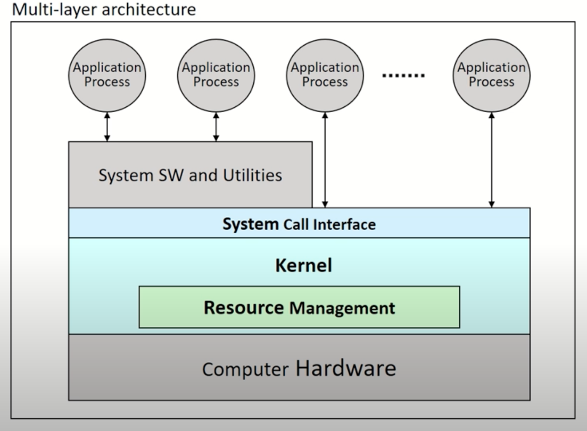
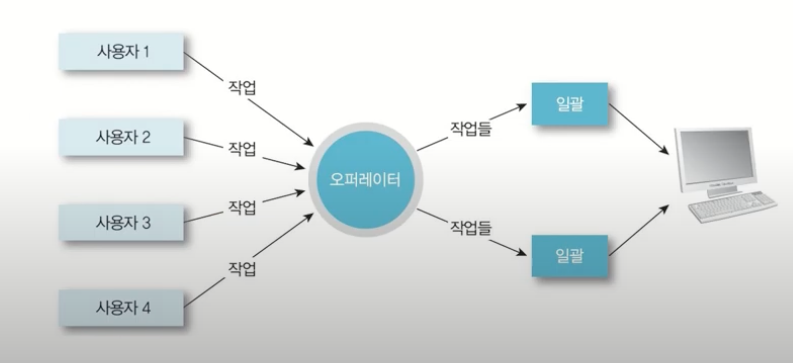
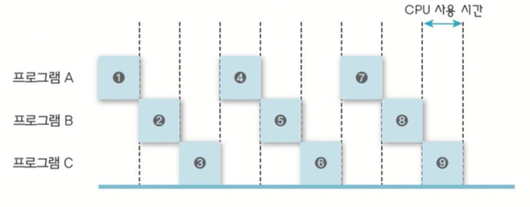
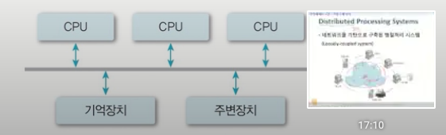
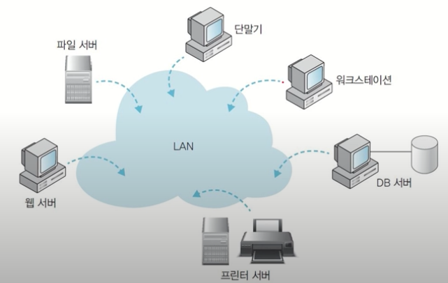
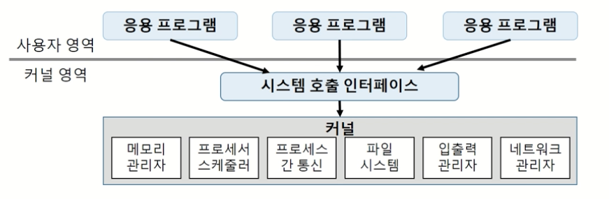
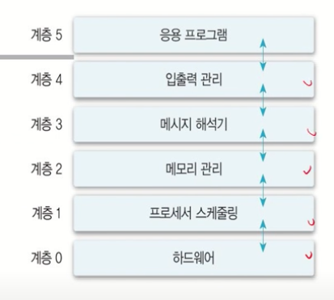
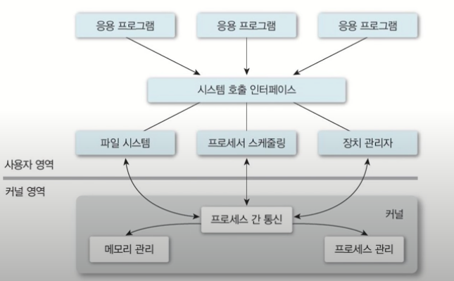

## 운영체제의 역할

* user interface(편리성)
  * cui : 문자기반
  * gui : 그래픽 기반
  * euci (end-user comfortable interface) : 특별한 목적만을 위해 만들어진 시스템을 위한 ui ex) mp3 ui

* resource management(효율성)
  * HW resources 
  * SW resources 

* process and Thread(조금 더 가벼운 프로세스) management
* 시스템 보호
 
 
### 컴퓨터 시스템의 구성 
 

- system call interface, kernel, resource ManageMent가 운영체제에 속함.
- 하드웨어 관리, 사용자에게 서비스 제공 역할 수행.
- 사용자가 직접 kernel에 접근하는 경우 문제가 발생하므로, os에게 요청하게되는데, system call interface(시스템 라이브러리)를 사용해서 요청.
   
 

## 운영체제 구분

### 동시 사용자수로 분류
  * single-user system 
    * 동시에 한명의 사용자가 모든 시스템 자원 독점.
    * 자원관리와 시스템 보호가 간단함.
    * window 7/ 10, mac os, android 등등
  * multi-user system
    * 동시에 여러 사용자들이 접근.
    * 구조가 복잡. multitaking 필요
    * 서버, 클러스터 장비, unix 등등
 
 

### 동시 실행 프로세스 수
 * 단일 작업
  * 시스템 내에 하나의 작업만 존재
  * 운영 체제 구조가 간단
    * ms-dos
  * 다중 작업
    * 동시에 여러 작업의 수행가능(동시수행, 동기화를 관리해야함)
    * 구조가 복잡.
    * unix, linux, window 등등
 
 

### 작업 수행 방식
  * 순차처리
    * 운영체제의 개념이 존재하지 않음(사용자가 직접 기계어로 직접 프로그램 작성)
    * 실행하는 작업 별 순차처리.

  * 배치 시스템  
   
    * 모든 시스템을 중앙에서 관리 및 운영
    * 사용자의 요청 작업을 일정부분 모아두었다가, 한번에 처리 
    * 장점 : 많은 사용자가 시스템 자원 공유, 처리 효율 향상
    * 단점 : 생산성 저하(같은 유행의 작업들이 모이기를 기다려야함), 긴 응답시간(작업 제출, 결과 출력시간이 길다.).

  * time sharing system  
   
    * 여러 사용자가 시스템 및 가상 메모리 관리
    * 사용자 지향적. 단말기 사용.
    * 장점 : 응답시간 단축, 생산성 향상
    * 단점 : 통신 비용 증가, 개인 사용자 체감 속도 저하.

  * personal computing
    * 개인이 시스템 전체 독점, cpu 활용률이 고려 대상이 아님
    * os가 상대적으로 단순함
    * 장점: 빠른 응답시간
    * 단점 : 성능이 낮다.

  * parallel processing system  
   
    * 단일 시스템 내에서 둘 이상의 프로세서 사용
    * 메모리 자원공유
    * 장점 : 성능 항상, 신뢰성 향상(하나가 고장 나더라도 시스템 돌릴수있음)
    * 단점 : 프로세서간 관계 및 역할 관리 필요, 확장 한계
  * distributed processing systems  
   
    * 네트워크 기반 구축 병렬처리 시스템.
    * 장점 : 자원 공유를 통한 높은 성능, 고신뢰성, 높은 확정성
    * 단점 : 구축 및 관리가 어려움
  * real-time system
    * 작업 처리에 대한 제한 시간을 갖는 시스템
      * hard real-time system task
        * 시간 제약을 지키지 못하면, 시스템에 치명적인 영향
        * 발전소, 무기 제어 등등
      * soft real-time system task
        * 실시간으로 처리되는 것이 좋지만, 필수는 아님.
        * 동영상 재생.
      * none real-time task

### 운영체제의 구조

* 커널 
  * os의 핵심(메모리에 상주)
  * 핵, 관리자 프로그램, 상주 프로그램, 제어 프로그램 과 동의어
  * 가장 빈번하게 사용되는 기능들을 담당함(ex 프로세서 , 메모리 관리)
* 유틸리티
  * 비상주 프로그램. ui등 서비스 프로그램.
 
 

* 단일 구조 운영 체제  
 
 * 장점 : 커널 내 모듈간 직접 통신(빠르고 효율적 자원 관리)
 * 단점 : 커널의 거대화(유지보수 문제), 동일 메모리에 모든 기능이 들어있어, 한 모듈의 문제가 전체 시스템에 영향을 줄수 있음.

* 계층 구조 운영 체제  
 
  * 장점 : 모듈화(검증 및 수정 용이), 구현의 단순화
  * 단점 : 단일 구조 대비 성능 저하

* 마이크로 커널 
 
  * 커널 크기의 최소화(필수 기능만 포함)
  * 기타 기능은 사용자의 영역에서 수행.

### 운영 체제의 기능
  * 프로세스 관리
    * 프로세스란 ? 커널에 등록된 실행 단위(실행중인 프로그램),사용자 요청/ 프로그램의 수행 주체
    * 자원할당, 생성/삭제 상태 관리, 프로세스간 통신 및 동기화, 교착상태(deadlock) 해결

  * 프로세서 관리
    * 프로세서란 ? cpu
    * 프로세스 스케쥴링, 프로세서 할당 관리.
  * 메모리 관리
    * 메모리란 ? 주기억장치, 작업을 위한 프로그램 및 데이터를 올려 놓는 공간.
    * 프로세스에 대한 메모리 할당 및 회수, 메모리 여유 공간 관리, 각 프로세스의 할당 메모리 영역 접근 보호.
  
  * 파일 관리
    * 파일이란 ? 논리적 데이터 저장 단위.
    * 사용자 및 시스템의 파일 관리, 디렉토리 구조 지원, 백업, 삭제 , 생성 등등 
  * 입출력 관리
    * 프로세스에 직접 입력 불가능 반드시 운영체제를 거쳐서 입력해야함. 
  * 보조 기억 장치 및 기타 주변 장치 관리
  * 보안, 디스크, 네트워킹 등등
