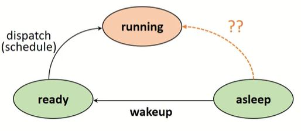

# Lecture 3. Process Management

 

## 목차
> [1. Process의 개념](#1.-process의-개념)  
> [2. PCB(프로세스 관리 블록)](#2.-pcb-프로세스-관리-블록)  
> [3. 프로세스 상태 변화](#3.-프로세스-상태-변화)  
> [4. 인터럽트(Interrupt)](#4.-인터럽트-interrupt)  
> [5. Context Switching(문맥 교환)](#5.-context-switching-문맥-교환)  

 

## 1. Process의 개념

### 프로세스의 정의
  - 실행중인 프로그램
  - 실행을 위해 시스템(커널)에 등록된 작업
  - 시스템 성능 향상을 위해 커널에 의해 관리됨
  - 각종 자원들을 요청하고 할당 받은 개체
  - 능동적인 개체(active entity)
    - 실행 중에 각종 자원을 요구, 할당, 반납하며 진행
  - Abstraction for CPU sharing
    - CPU를 공유하는 여러 작업 간의 구분을 위한 단위로 사용
    - 각 프로세스는 컴퓨터 시스템을 독점해서 사용하는 것으로 인식

 

### 프로세스의 구성
- CPU 상태
  - register
- 메모리
  - Text (프로그램 코드 저장)
  - Data (프로그램 초기 데이터 저장)
  - Heap
  - Stack

 

### 프로세스의 종류

 

### 프로세스 유사 용어
 - Job : Batch System
 - Program : 실행되기 전의 프로그램 이미지
   - passive state(program) vs actice state(process)
   - 한 프로그램은 여러 프로세스로 구성될 수 있음
 - Task : 일반적 의미로 job과 유사
   - cpu에서의 task : 하나의 실행 흐름
 - Thread : Lightweight process
 - Processor : cpu 프로세서

 

### 자원(Resource)의 개념
- 커널의 관리 하에 프로세스에게 할당 / 반납되는 수동적 개체(passive entity)

  

## 2. PCB-프로세스 관리 블록

### Process Control Block
- OS가 프로세스 관리에 필요한 정보 저장, 프로세스 생성시 생성
- 각 프로세스들에 대한 상태정보 저장

 

### PCB가 관리하는 정보
- PID
- 스케줄링 정보
- 프로세스 상태
- 메모리 관리 정보
- 입출력 상태 정보
- 문맥저장 영역
- 계정 정보
> PCB 정보는 OS 별로 서로 다름
> 
> PCB 참조 및 갱신 속도가 OS의 성능을 결정짓는 요소 중 하나

 

  

## 3. 프로세스 상태 변화

### 프로세스 상태 및 특성

- Created
  - 작업(Job)을 커널에 등록
  - PCB 할당 및 프로세스 생성
- 
  - 가용 메모리 공간 상태에 따라 프로세스 상태 전이

 

- Ready 
  - 프로세서 외에 다른 모든 자원을 할당 받은 상태
  - 프로세서 할당 대기 상태, 즉시 실행 가능 상태
- 

 

- Running
  - 프로세서와 필요한 자원을 할당 받아 실행중인 상태
- 
  - preemption (프로세서 스케줄링 time-out, priorty changes)
  - block/sleep (I/O 등 자원 할당 요청)

 

- Blocked/Asleep
  - 프로세서 외에 다른 자원을 기다리는 상태
  - 자원 할당은 System call에 의해 이루어짐
- 

 

- Suspended
  - 메모리를 할당 받지 못한 상태
  - 커널 또는 사용자에 의해 발생
  - memory image를 swap device(프로그램 정보 저장을 위한 파일 시스템)에 보관

 

- Terminated/Zombie
  - 프로세스 수행이 끝난 상태
  - 모든 자원 반납 후 커널 내에 일부 PCB 정보만 남아있는 상태 (이후 프로세스 관리를 위한 정보)

 

### 프로세스 관리를 위한 자료구조
  - 커널 내에 ready queue, waiting queue, running queue를 두고 프로세스들을 상태에 따라 관리

  

## 4. 인터럽트-Interrupt
- 예상치 못한 외부에서 발생한 이벤트
- I/O, Clock, Console, Program check, Machine check, Inter-process, System call 등 다양한 인터럽트 종류

 

### 인터럽트 처리 과정

  

## 5. Context Switching-문맥 교환

- Context
  - 프로세스와 관련된 정보들의 집합
- CPU가 다른 프로세스를 처리할 때, 기존에 작업하던 프로세스의 정보를 저장하고(Context saving) 새로 처리할 프로세스의 상태를 불러오는 것(Context restoring)
- 기본적으로 overhead(비용)가 발생한다
  - OS마다 다르며 성능에 큰 영향을 미친다
- Thread 등을 사용하여 불필요한 context switching을 줄여야 함