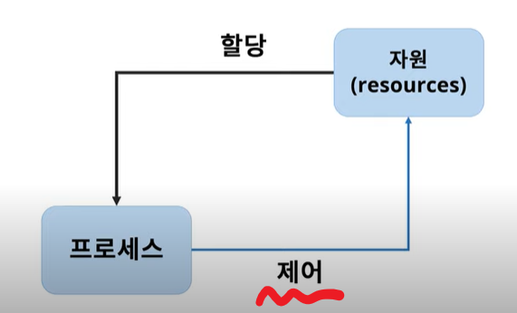
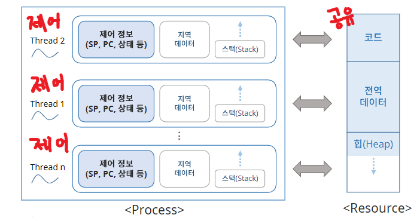
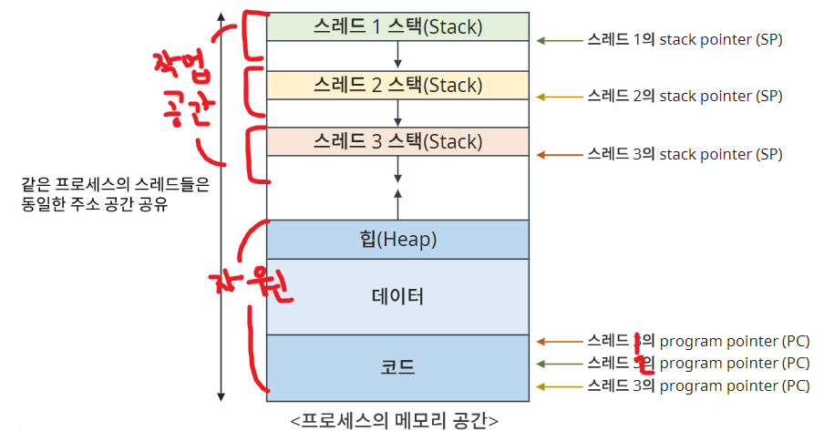
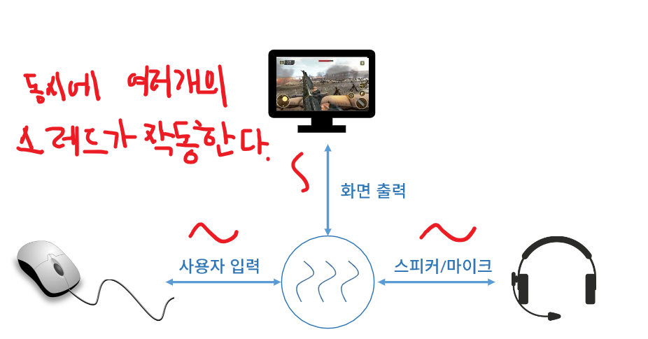
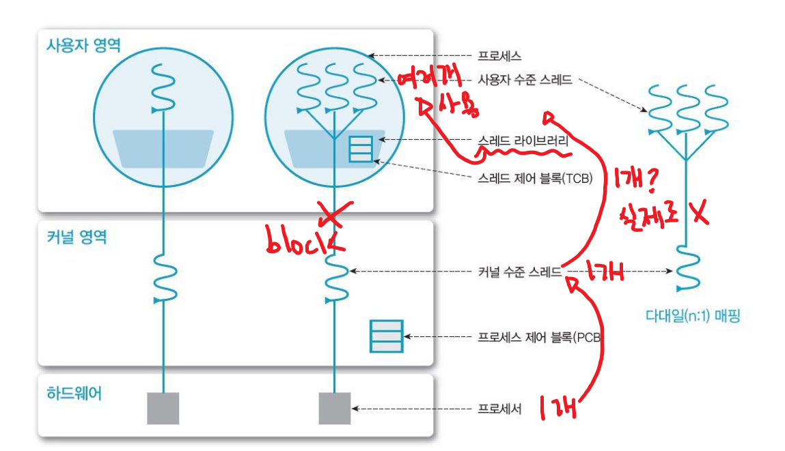
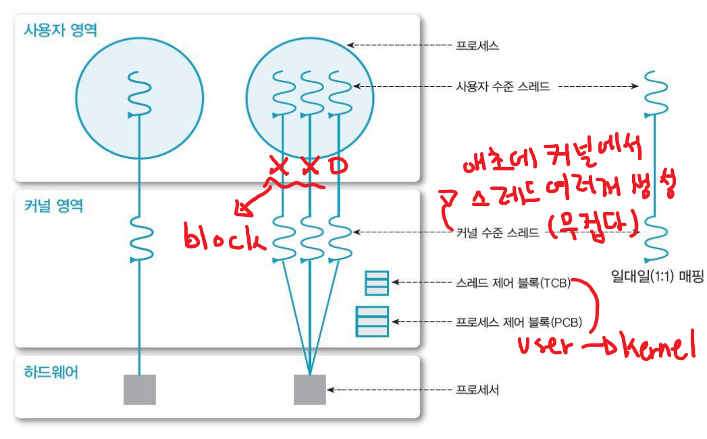
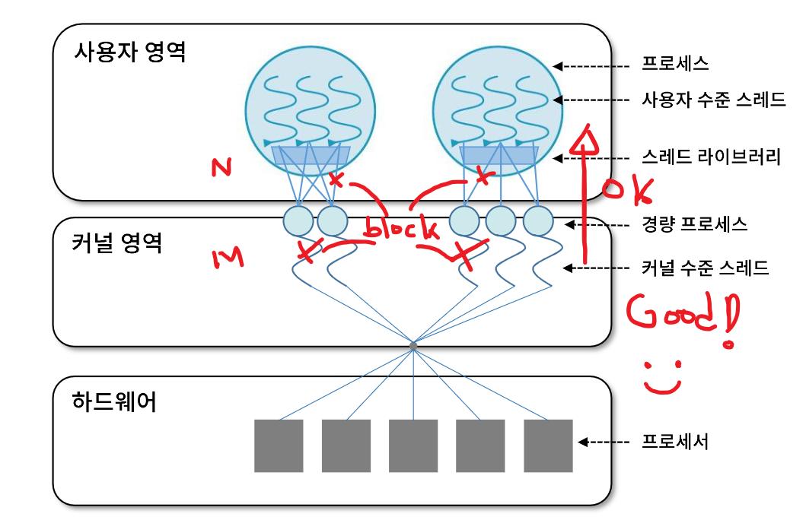

# Lecture 4 스레드 관리

> ### Contents
>
> 1. [프로세스(Process)와 스레드(Thread)](#1.-프로세스(process)와-스레드(thread))
> 2. [스레드(Thread)](#2.-스레드(thread))
> 3. [스레드의 장점 및 사용예시](#3.-스레드의-장점-및-사용예시)
> 4. [스레드의 구현](#4.-스레드의-구현)

### 1. 프로세스(Process)와 스레드(Thread)

> #### 프로세스

- 어떠한 목적을 위해 연산을 하는 과정
- 자원을 할당받고 그 자원을 제어

>  #### 스레드

- 프로세스가 돌아가는 과정 중 "제어" 부분을 의미한다.
- 하나의 프로세스에 여러개의 스레드로 제어 할 수 있다.

___

### 2. 스레드(Thread)

> #### Resource

- 코드
  - 사용자가 짠 프로그램 코드

- 전역데이터
  - 작업을 하기위한 데이터

- 힙(Heap)
  - 프로세스가 사용하는 메모리 공간

  

> #### Process

- 프로세스의 제어 부분을 "스레드"라고 하고 스레드는 동시에 여러개가 있을 수 있다.

- 스레드들은  하나의 자원을 공유한다.

- Light Weight Process (LWP)
  - 프로세스: 자원 O 제어 O
  - 스레드: 자원 (공유) 제어 O  -> 상대적으로 가볍다.
- 프로세서(CPU) 활용의 기본단위
  - 프로세스는 여러개의 스레드 / CPU를 사용할 수 있다.
- 구성요소
  - Thread ID : 자신만의 ID
  - Reguster set : 제어를 위해 알고있어야하는 정보
  - Stack: 자신만의 작업영역
- **제어요소 외 코드, 데이터 및 자원들은 프로세스 내 다른 스레드들과 공유한다.**

___

### 3. 스레드의 장점 및 사용예시

> #### 스레드의 장점

- **사용자 응답성 (Responsiveness)**
  - 일부 스레드 처리가 지연되어도, 다른 스레드는 작업을 계속 처리할 수 있다.
- **자원 공유 (Resource sharing)**
  - 자원을 공유하므로 효율성이 증가한다.
- **경제성 (Economy)**
  - 프로세스의 생성, context switch에 비해 효율적이다.
- **멀티 프로세서(multi-processor) 활용**
  - 병렬처리를 통해 성능이 향상된다.

> #### 스레드 사용의 예

___

## 4. 스레드의 구현

> #### 사용자 수준 스레드 (User Thread)

- 사용자 영역의 스레드 라이브러리로 구현된다.
- 커널은 스레드의 존재를 모른다.
- 다대일(n : 1) 모델

> #### 커널 수준 스레드 (Kernel Threads)

- OS(Kernal)가 직접관리한다.
- 커널 영역에서 스레드의 생성과 관리 수행을 한다.
- 커널이 각 스레드를 개별적으로 관리한다.
- 일대일(1 : 1) 모델

> #### 혼합형 (n : m) 스레드

- n개 사용자 수준 스레드, m개의 커널 스레드 (n > m)
- 효율적이면서 유연하다.

___

