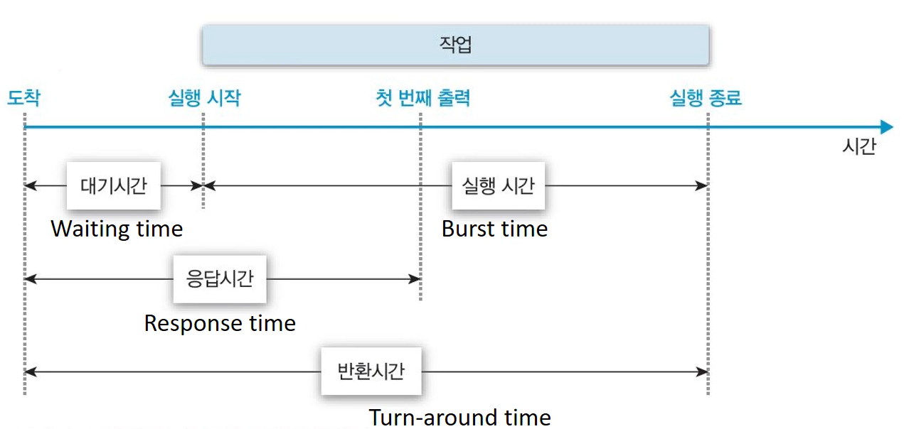

## **스케줄링(Scheduling)**

---

-   여러개의 프로세스가 시스템 내 존재하는 다중 프로그래밍에서 자원 할당을 위한 프로세스를 선택하는 과정

**자원 관리에 대한 분류**

-   **시간 분할(Time Sharing) 관리**
    -   하나의 자원을 여러 스레드가 번갈아 가며 사용
    -   ex) 프로세서(Processor) - **프로세스** **스케줄링**
-   **공간 분할(Space Sharing) 관리**  
    -   하나의 자원을 분할하여 동시에 사용
    -   ex) 메모리(Memory)

### **스케줄링의 목적**

-   **시스템 성능(Performance)** 향상

 **시스템 성능 지표**

-   **응답시간(Response Time)**: 작업 요청(Submission)으로부터 응답을 받을 때까지의 시간
    -   Interactive System 대화식 시스템 / Real-time System 실시간 시스템
-   **작업 처리량(Throughput)**: 단위 시간 동안 완료된 작업의 수
    -   Batch Processing System 일괄 처리 시스템
-   **자원 활용도(Resource Utilization)**: 주어진 시간(Tc) 동안 자원이 활용된 시간(Tr) = Tr/Tc
-   **공평성(Fairness)**
-   **실행 대기 방지**
-   **예측 가능성(Predictability)**

⁞

## **프로세스 스케줄링(Process Scheduling)**

---

### **용어**

</img>

-   **대기시간(Waiting time)**
-   **응답시간(Response time)**
-   **실행시간(Burst time)**
-   **반환시간(Turn-around time)**

#### **스케줄링 기준(Criteria)**

-   **프로세스의 특성**
    -   I/O-bounded / Compute-bounded

더보기

프로세스의 수행 = CPU burst(CPU 사용 시간) + I/O burst (I/O 대기 시간)

-   Compute-bounded Process : CPU burst time이 더 긴 경우
-   I/O-bounded Process: I/O burst time이 더 긴 경우

-   **시스템 특성**
    -   Batch system / Interactive system
-   **프로세스의 긴급성**
    -   Hard-real time system / Soft-real time system / Non-real time system
-   **프로세스 우선순위(Priorty)**
-   **프로세스 총 실행 시간(Total Service Time)**

⁞

#### **스케줄링 단계(Level)**

</img>

**1) Long-term Scheduling 장기 스케줄링**

-   Job Scheduling : 시스템에 제출할(커널에 등록할) 작업 결정
-   다중 프로그램 정도(Multi-programming Degree) 조절
    -   시스템 내 프로세스 수 조절
-   시분할 시스템(Time Sharing System)에서는 상대적으로 불필요

**2) Mid-term Scheduling 중기 스케줄링 / Intermediate-level Scheduling**

-   Memory Allocation : 메모리 할당 결정

**3) Short-term Scheduling 단기 스케줄링 / Low-level Scheduling**

-   Process Scheduling : 프로세서를 할당할 프로세스 결정
-   가장 빈번하게 발생

#### **스케줄링 정책(Policy)**

**1) 선점(Preemptive Scheduling) vs 비선점(Non-preemptive Scheduling)**

-   **선점 스케줄링(Preemptive Scheduling)**
    -   타의에 의해 자원을 빼앗길 수 있는 방식
    -   시분할 시스템(Time Sharing System), 실시간 시스템(Real-time System) 적합
    -   Context switch Overhead가 큼
-   **비선점 스케줄링(**Non-preemptive Scheduling)****
    -   할당 받을 자원을 스스로 반납할 때까지 사용하는방식
    -   Context switch Overhead가 작음
    -   (단점) 평균 응답 시간 증가
    -   (단점) 우선순위 역전 현상 발생

**2) 우선순위(Priority)**

-   **정적 우선순위(Static Priority)**
    -   프로세스 생성시 결정된 우선순위가 유지
    -   (장점) 구현이 쉽고, 오버헤드가 적음
    -   (단점) 시스템 환경 변화에 대응 어려움
-   **동적 우선순위(Dynamic Priority)**
    -   프로세스의 상태 변화에 따라 우선순위 변경
    -   (장점) 시스템 환경 변환에 유연한 대응 가능
    -   (단점) 구현 복잡, 우선순위 재계산 오버헤드가 큼

##   
**기본 스케줄링 알고리즘(Basic Scheduling Algorithms)**

---

### **FCFS(First-Come-First-Service)** \- 공평성(Fairness)

</img>

-   **정의**
    -   **도착시간(ready queue)**을 기준으로 먼저 도착한 프로세스 먼저 처리
-   **특징**
    -   비선점 스케줄링
    -   자원의 효율적 사용 가능
    -   Batch system 적합, Interactive system 부적합
-   **단점**
    -   Convoy Effect : 하나의 수행시간이 긴 프로세스에 의해 다른 프로세스들이 긴 대기시간을 갖게 되는 현상(대기시간 > 실행시간)
    -   긴 평균 응답시간(Response time)

### **RR(Round-Robin)**\- 공평성(Fairness)

</img>

-   **정의**
    -   **도착시간(ready queue)**을 기준으로 먼저 도착한 프로세스 먼저 처리, 하지만 **자원 사용 제한 시간(Time quantum)**이 존재
-   **특징**
    -   선점 스케줄링
    -   특정 프로세스의 **자원 독점(Monopoly)** 방지
    -   Interactive system와 Time Sharing System 적합
-   **단점**
    -   Context switch Overhead가 큼

### **SPN(Shortest-Process-Next)** - 효율성/성능(Efficiency/Performance)

-   **정의**
    -   **실행시간(burst time)**을 기준으로 실행시간이 가장 작은 프로세스 먼저 처리
    -   비선점 스케줄링
-   **장점**
    -   평균 대기시간(WT) 최소화
    -   시스템 내 프로세스 수 최소화
        -   스케줄링 부하 감소
        -   메모리 절약
    -   많은 프로세스에 대한 빠른 응답 시간
-   **단점**
    -   **무한대기(Starvation)** 현상 발생
        -   실행시간이 긴 프로세스는 자원을 할당 받지 못하는 상황 발생\]
        -   Aging 등으로 해결(HRRN)
    -   정확한 실행 시간 예측 불가

### **SRTN(Shortest Remaining Time Next)** - 효율성/성능(Efficiency/Performance)

-   **정의**
    -   **잔여 실행시간(burst time)**이 더 적은 프로세스가 ready queue에 선점되는 방식
    -   선점 스케줄링
    -   SPN의 변형
-   **장점**
    -   SPN 장점 극대화
-   **단점**
    -   프로세스 생성시 총 실행 시간 예측 필요
    -   오버헤드
        -   실행시간 예측 부하
        -   Context switch Overhead
    -   구현 및 사용이 비현실적

### **HRRN(Hige-Response-Ratio-Next)** \- 효율성/성능(Efficiency/Performance)

-   **정의**
    -   **\*Response ratio(응답률)**을 기준으로 해당 기준이 높은 프로세스 우선 배치
    -   비선점 스케줄링
    -   SPN + \*Aging Concepts

\*Response ratio(응답률) : (WT+BT)/BT = (대기시간+실행시간)/실행시간

\*Aging Concepts : 프로세스의 대기시간을 고려하여 기회 제공

-   **장점**
    -   SPN의 무한대기(Starvation) 방지
-   **단점**
    -   (오버헤드) 실행시간 예측 부하

### **MLQ(Multi-level Queue)**

</img>

-   **정의**
    -   작업/우선순위별 별도의 Ready Queue를 가짐
        -   최소 배정된 Queue에서 벗어나지 못함
        -   각각의 Queue는 자신만의 스케줄링 기법 사용
    -   Queue 사이에 우선순위 기반의 스케줄링 사용
-   **장점**
    -   우선순위가 높은 큐에 대한 빠른 응답시간
-   **단점**
    -   스케줄링 오버헤드
    -   우선순위가 낮은 Queue의 무한대기(Starvation) 현상 발생 가능

### **MFQ(Multi-level Feedback Queue)**

</img>

-   **정의**
    -   프로세스의 Queue간 이동이 허용된 MLQ
    -   피드백을 통해 우선순위 조정
        -   현재까지의 프로세서 사용 정보 활용
-   **특징**
    -   동적 우선순위 
    -   선점 스케줄링
    -   프로세스에 대한 사전 정보 없이(실행시간 예측 없이) SPN, SRTN, HRRN 기법의 효과 사용 가능
-   **단점**
    -   설계 및 구현 복잡
    -   스케줄링 오버헤드
    -   무한대기
-   **변형**
    -   각 준비 큐마다 **시간 할당량** 다르게 배정
        -   프로세스의 특성에 맞는 형태로 시스템 운영 가능
    -   **입출력 위주 프로세스**를 상위 단계의 큐로 이동, 우선순위 높임
    -   대기시간이 지정된 시간을 초과한 프로세스들을 상위 큐로 이동
        -   **에이징(Aging) 기법**

⁞

---

출처 :[Youtube,HPC Lab. KOREATECH](https://www.youtube.com/watch?v=_gNeoGQx-Tc&list=PLBrGAFAIyf5rby7QylRc6JxU5lzQ9c4tN&index=8)