# **Lecture 7. Deadlock**

 

## Deadlock의 개념
- Blocked/Asleep state
  - 프로세스가 틀정 이벤트를 기다리는 상태
  - 프로세스가 필요한 자원을 기다리는 상태
- **Deadlock state**
  - '교착 상태'라고 하며 한정된 자원을 여러 곳에서 사용하려고 할 때 발생
  - 프로세스들이 자원을 점유한 상태에서 서로 다른 프로세스가 점유하고 있는 자원을 요구하며 무한정 기다리는 현상
  - 프로세스가 발생 가능성이 없는 이벤트를 기다리는 경우

 
 

### Deadlock vs Starvation
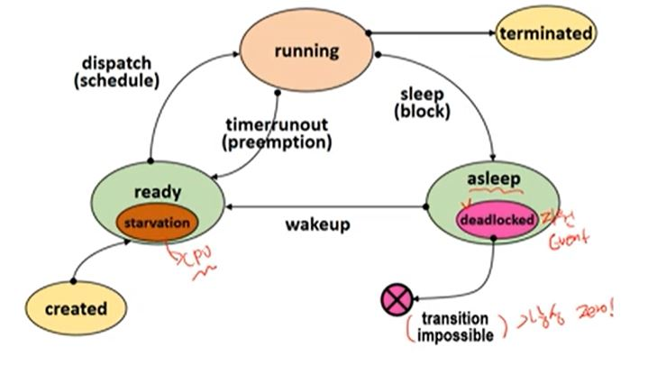

 
 

## 자원의 분류
1. 선점 가능 여부에 따른 분류
   - Preemptible resources 
     - 선점 당한 후, 돌아와도 문제가 발생하지 않는 자원
     - Processor, memory
   - Non-preemptible resources
     - 선점 당하면, 이 후 진행에 문제가 발생하는 자원
      - disk drive
2. 할당 단위에 따른 분류
   - Total allocation resources
     - 자원 전체를 프로세스에 할당
     - Processor, disk drive
   - Partitioned allocation resources
     - 하나의 자원을 여러 조각으로 나누어, 여러 프로세스들에게 할당
     - Memory
3. 동시 사용 가능 여부에 따른 분류
   - Exclusive allocation resources
     - 한 순간에 한 프로세스만 사용 가능한 자원
     - Processor, memory, disk drive
   - Shared allocation resources
     - 여러 프로세스가 동시에 사용 가능한 자원
     - Program(sw), shared data
4. 재사용 가능 여부에 따른 분류
   - SR(Serially-reuseable Resources)
     - 시스템 내에 항상 존재하는 자원
     - 사용이 끝나면, 다른 프로세스가 사용 가능
      - Processor, memory, disk drive, program
   - CR(Consumable Resources)
     - 한 프로세스가 사용한 후에 사라지는 자원
     - signal, message

 
 

## Deadlock과 자원의 종류

### Deadlock을 발생시키는 자원의 형태
  - Non-Preemptible resources
  - Exclusive allocation resources
  - Serially reusable resources

 
 

## Deadlock 발생의 예
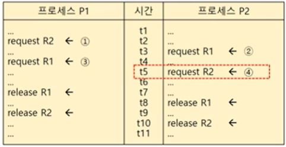

 
 

## Deadlock Model(표현법)
### Graph Model
- Node
  - 프로세스 노드, 자원 노드
- Edge
  - P->R : 프로세스가 자원을 요청
  - R->P : 자원이 프로세스에 할당

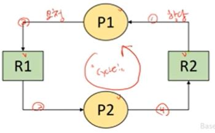

## State Transition Model
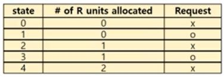
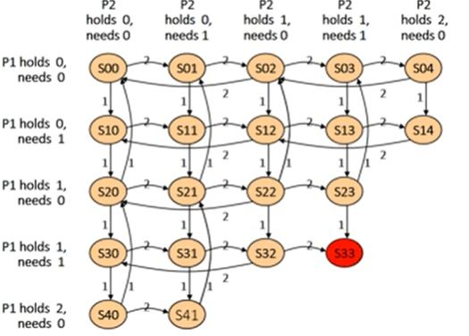

 
 

## Deadlock 발생 필요 조건
- Exclusive use of resources
- Non-preemptible resources
- Hold and wait(Partial allocation)
  - 자원을 하나 hold하고 다른 자원 요청
- Circular wait

 
 

## Deadlock 해결 방법

### Deadlock Prevention(교착상태 예방)
  - 4개의 발생 필요 조건 중 하나를 제거
  - Deadlock이 절대 발생하지 않음

1. Exclusive use of resources 조건 제거
     - 모든 자원 공유 허용(불가능)
2. Non-preemptible resources 조건 제거
     - 모든 자원 선점 허용(불가능)
3. Hold and wait 조건 제거
     - 필요 자원 한번에 모두 할당(Total alloction)
     - 필요하지 않은 순간에도 가지고 있다 => 자원 낭비
     - 무한 대기 현상 발생 가능(불가능)
4. Circular wait 조건 제거
     - 자원들에게 순서 부여, 프로세스는 순서의 증가 방향으로만 자원 요청 가능(Totally allocation을 일반화 한 방법)
     - 자원 낭비 발생(불가능)
- Prevention 방법은 심각한 자원 낭비 발생
- 비현실적

 
 

### Deadlock Avoidance(교착상태 회피)
  - 시스템의 상태를 계속 감지
  - 시스템이 deadlock 상태가 될 가능성이 있는 자원 할당 요청 보류
  - 시스템을 항상 **safe state**로 유지
  - safe state : safe sequence가 존재(모든 프로세스가 정상) => Deadlock 상태가 되지 않을 수 있음을 보장
  - unsafe state : deadlock 상태가 될 가능성이 있음
  - 가정
    - 프로세스 수가 고정됨
    - 자원의 종류와 수가 고정됨
    - 프로세스가 요구하는 자원 및 수량을 알고 있음
    - 프로세스는 자원을 사용 후 반드시 반납한다
  - Dijkstra's banker's algorithm
    - 가정 : 한 종류(resource type)의 자원이 여러 개(unit)
    - 시스템을 항상 safe state로 유지
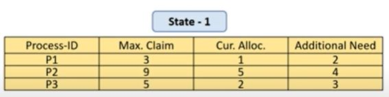
-> available resource units이 2일때 P1->P3->P2의 safe sequence가 존재
=> 현재 상태에서 안전 순서가 하나 이상 존재하면 **safe state**
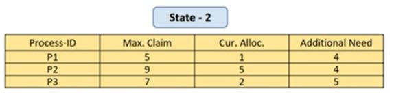
-> available resource units이 3일때 safe sequence가 존재하지 않는다
=> 시스템은 교착상태에 놓일 수 있음
    - 현재 상태에서 자원 요청이 들어왔을 때 해당 자원을 주었다고 가정하고, 시뮬레이션 결과 safe sequence가 존재하면 할당, 존재하지 않으면 거정
  - Harbermann's algorithm
    - Dijkstra's banker's algorithm의 확장
    - 여러 종류의 자원(multiple resource types)을 고려
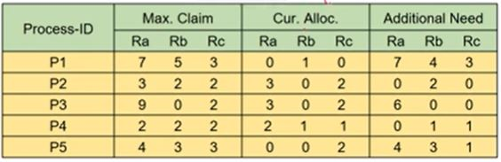
-> P2가 (1,0,2)를 요청할 때, P2->P4->P1->P3->P5의 safe sequence가 존재
=> **safe state**이므로 자원을 할당한다
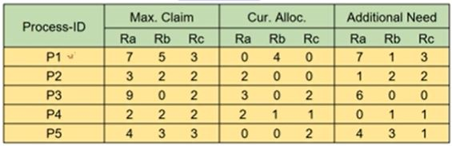
-> P1가 (0,3,0)를 요청할 때, safe sequence가 존재하지 않는다
=> **unsafe state**이므로 자원을 할당하지 않는다
  - Deadlock의 발생을 막을 수 있음
  - High overhead
  - Low resource utilization
  - Not practical (프로세스, 자원 수가 고정, 필요한 최대 자원 수를 알고 있음)

 
 

### Deadlock Detaction and Deadlock Recovery(교착상태 탐지 및 복구)

- Deadlock Detection
  - Resource Allocation Graph(RAG)를 사용하여 주기적으로 deadlock발생 확인
  - Resource Allocation Graph(RAG)
    - directed, bipartite graph
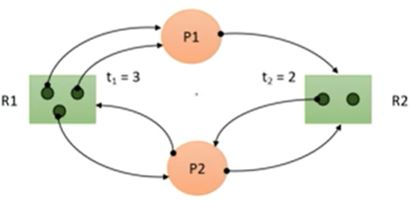
  - Graph reduction
    - 주어진 RAG에서 Unblocked process(필요한 자원을 모두 할당 받을 수 있는 프로세스) 에 연결된 모든 edge를 더 이상 지울 수 있는 edge가 없을 때까지 반복해서 제거
    - 모든 edge가 제거된다면(Completely reduced) 현재 deadlock에 빠진 프로세스가 없음
    - 지울 수 없는 edge가 존재한다면(irreducible) 현재 하나 이상의 프로세스가 deadlock 상태 => 자원을 할당 받을 수 없는 프로세스가 존재
    - High overhead(검사 주기에 영향을 받으며, Node의 수가 많은 경우) -> low overhead를 가지는 방법 또한 존재(Single-unit resources, Single-unit request in expedient state)

 
 

- Deadlock Avoidance vs Detection
  - Deadlock Avoidance
    - 최악의 경우를 생각하여 deadlock이 발생하지 않음
  - Deadlock Detection
    - 최선의 경우를 생각하여 deadlock 발생 시 recovery 과정이 필요

 
 

- Deadlock Recovery
  - Deadlock을 검출 한 후 해결하는 과정
  - Process termination
    - Deadlock 상태에 있는 프로세스를 일부 종료시킨다
    - 강제종료 된 프로세스는 이후 재시작
    - Termination cost model
      - 종료시킬 deadlock 상태의 프로세스 선택
      - Termination cost (우선순위, 종류, 총 수행시간, 남은 수행 시간, 종료 비용 등)
    - 종료 프로세스 선택
      - ex) lowest-termination cost process first, minimum cost recovery
  - Resource preemption
    - Deadlock 상태 해결을 위해 선점할 자원 선택
    - 선정된 자원을 가지고 있는 프로세스에서 자원을 빼앗는다(빼앗긴 프로세스는 강제 종료)
    - deadlock 상태가 아닌 프로세스가 종료될 수 있음
    - 해당 프로세스는 이후 재시작
    - Preemption cost model
      - 선점할 자원 선택
      - ex) minimum cost recovery method
  - Checkpoint-restart method
    - 프로세스의 수행 중 특정 지점(checkpoint) 마다 context를 저장(종료된 프로세스가 효율적으로 재시작하기 위한 방법)
    - Rollback을 위해 사용
      - 프로세스 강제 종료 후 가장 최근 checkpoint에서 재시작
  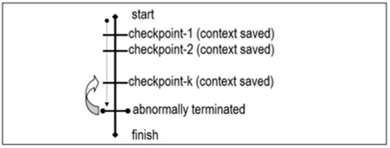