# Lecture 8 메모리 관리

> ### Contents
>
> 1. Address Binding
> 2. Continuous memory allocation

### 1. Address Binding

> 메모리(기억장치) 계층구조

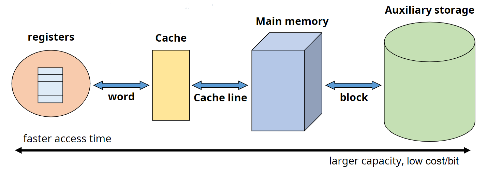

- Block: 보조기억장치와 주기억장치 사이의 데이터 전송단위
  - Size: 1 ~ 4KB
- Word: 주기억장치와 레지스터 사이의 데이터 전송단위
  - SIze: 16 ~ 64 bits

> Address Binding

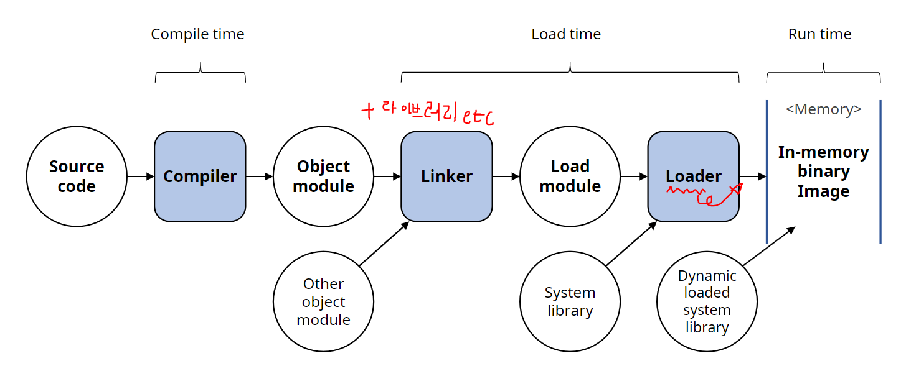

- Compile time binding
  - 절대 주소값에 주소를 배당하기 때문에 모든 정보를 알고있어야하므로 프로그램 전체가 메모리에 올라가야한다.
- Load time binding
  - 일단 주소를 상대적으로 정해두고 실제로 배당할 때는 메모리 상황에 따라서 주소를 설정해준다.
- Run time binding
  - binding을 Run하는 시점까지 연기했다가 해준다.
  - 프로세스가 수행 도중 다른 메모리 위치로 이동할 수 있다.

> Dynamic Loading

- 언제나 프로그램 전체를 실행하여 메모리에 올릴 필요없이 교체가능한 형태로 나눠서 저장하여 그때그때 필요한 부분만 메모리에 올린다.
- 메모리 공간을 효율적으로 사용할 수 있다.

> Swapping

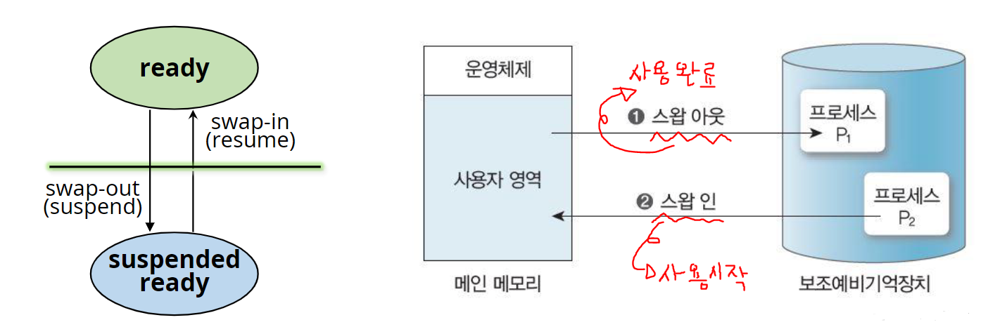

- 프로세서 할당이 끝나고 수행완료된 프로세스는 swap-device로 보낸다. (Swap-out)
- 새롭게 시작하는 프로세스는 메모리에 적재한다. (Swap-in)

### 2. Continuous memory allocation

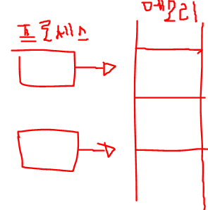

- 프로세스(context)를 하나의 연속된 메모리 공간에 할당하는 방법
- 고려해야할 사항들
  - 메모리에 동시에 올라갈 수 있는 프로세스 수
  - 각 프로세스에게 할당되는 메모리 공간 크기
  - 메모리를 분할하는 방법

> Uni-Programming

- 하나의 프로세스만 메모리 상에 존재한다.
- 가장 간단한 메모리 관리 기법이다.

문제점

1. 프로그램 자체가 메모리보다 크다면 사용자나 개발자가 잘라서 사용해주어야한다.

2. 프로그램의 범위가 커널(Kernel)을 건드리면 안되므로 보호할 방법이 필요하다.
3. 프로그램의 크기가 메모리보다 작다면 남는 공간이 낭비된다.

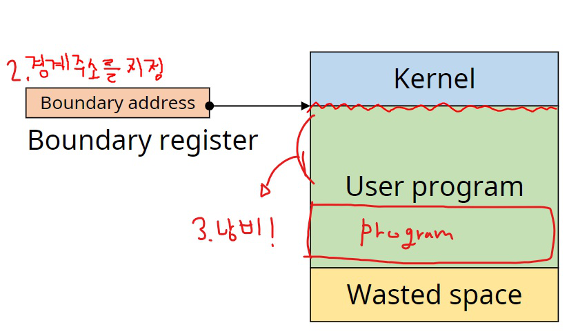

> Multi-Programming

1. Fixed Partitoin Multiprogramming (FPM)
   - 메모리 공간을 고정된 크기로 분할
   - 각 프로세스는 하나의 partition에 분배

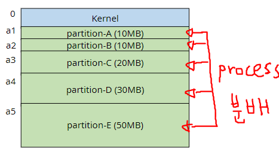

- Fragmentation (단편화)

  - 프로세스의 크기와 나눠진 메모리공간의 크기차이 때문에 메모리가 낭비되는 현상을 의미한다.
  - Internal fragmentation은 나누어진 메모리공간보다 process의 크기가 작아서 남는 메모리 공간이다.
  - External fragmentation은 남은 메모리공간 자체는 충분하지만, 공간이 나누어져있어서 프로세스가 들어가지 못한다.

  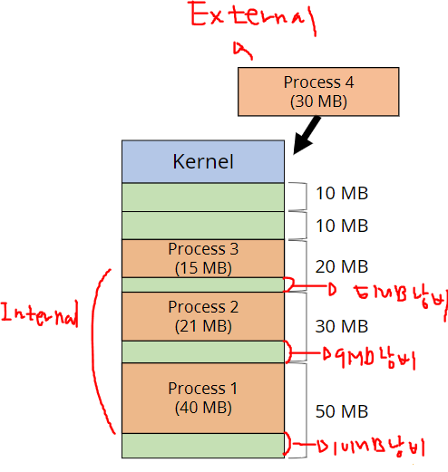

2. Variable Partition Multiprogramming (VPM)
   - 초기에는 전체가 하나의 영역
   - 프로세스를 처리하는 과정에서 메모리 공간이 동적으로 분할된다.
   - 적어도 Internal fragmentation은 일어나지 않는다.

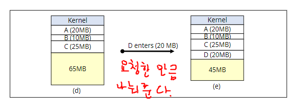

> 배치 전략 (Placement Strategies)

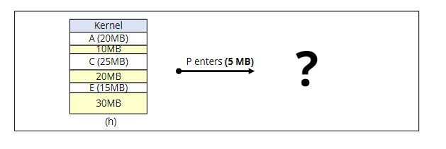

1.  First-fit (최초적합)
   - 들어갈 수 있는 첫 번째 partitoin을 선택한다.
   - 간단하지만 공간활용률이 떨어질 확률이 높다.

2. Best-fit (최적적합)

   - 프로세스가 들어갈 수 있는 partition중 가장 작은 곳을 선택한다.
   - 메모리의 낭비는 적지만, 탐색시간이 오래걸리고 partition이 너무 작게 많이 나누어진다.

3. Worst-fit (최악적합)

   - 프로세스가 들어갈 수 있는 partitoin 중 가장 큰 곳을 선택한다.
   - 작은 크기의 partion을 줄일 수 있지만 탐색시간이 오래걸리고 큰 프로세스에게 필요한 큰 크기의 partition확보가 어렵다.

4. Next-fit (순차 최초 적합)

   - 메모리가 할당되고 종료되다보면 한쪽만 자주 쓰이게될 확률이 높다. 
   - 마지막으로 탐색했던 위치부터 탐색하여 메모리 영역의 사용빈도를 균등하게 만들 수 있다.

5. Calescing holes (공간통합)

   - 인접한 빈 영역을 하나의 partittion으로 통합한다.

   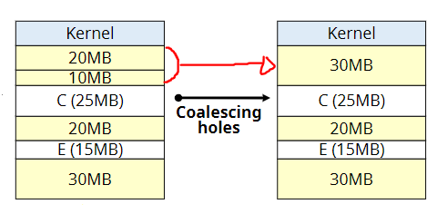

6. Storage Compactoin (메모리 압축)

   - 모든 빈 공간을 하나로 통합한다.
   - 모든 프로세스를 재배치하므로 프로세스가 중지되고 많은 시스템 자원을 소비한다.

   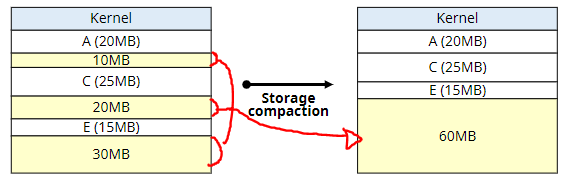